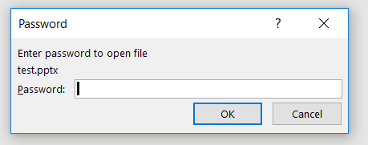

# win32 ignore pop up diaglogue for password

To automate a lot of power point files, it is sometimes stucked with the power point files with password. The issue for this problem is stated here:
https://stackoverflow.com/questions/51731292/python-win32com-powerpoint-application-skip-password-pop-up-dialogue

The method is to throw a thread that detects for the 'Password' pop-up diaglogue and close it. If no 'Password' pop-up dialogue is detected, then the thread is terminated through a flag.

The 'Password' pop-up dialogue of the PowerPoint is shown:

# Requirements

- windows system
- Microsoft PowerPoint is installed
